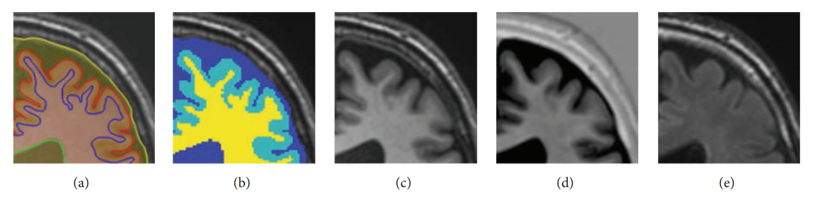

# Dataset

## MR Brain Segmentation Challenge 2013 Dataset

For each patient, the following MRI scans are provided:

- T1_1mm.nii: 3D T1-weighted scan (voxel size: 1.0mm x 1.0mm x 1.0mm)
- T1.nii: 3D T1-weighted scan registered to the T2 FLAIR (voxel size: 0.958mm x 0.958mm x 3.0mm)
- T1_IR.nii: Multi-slice T1-weighted inversion recovery scan registered to the T2 FLAIR (voxel size: 0.958mm x 0.958mm x 3.0mm)
- T2_FLAIR.nii: Multi-slice FLAIR scan (voxel size: 0.958mm x 0.958mm x 3.0mm)

All scans are bias corrected, and scans 2-4 are aligned. This is done to eliminate the influence of different registration and bias correction algorithms on the segmentation results. The manual labeling is done on scans 2-4. The 3D T1-weighted scan is provided for algorithms that prefer to use 3D data. However, the final results of your segmentation method should be aligned with scan 2-4, since the ground truth is only available for these scans! The face of the patient is cut out of the 3D T1-weighted scan for the purpose of anonymization. Some of the T1-weighted IR images contain artifacts at the bottom of the scan. These artifacts occur often in clinical scans, and it is therefore interesting to know how automatic segmentation methods that use these scans perform under these circumstances.

For the training data, manual segmentation are provided (LabelsForTraining.nii). The following structures are labeled:

1. Cortical gray matter
2. Basal ganglia
3. White matter
4. White matter lesions
5. Cerebrospinal fluid in the extracerebral space
6. Ventricles
7. Cerebellum
8. Brainstem

For the training data, we also provided labels that can be used for testing (LabelsForTesting.nii), in which only the following structures are labeled:

1. Cerebrospinal fluid (including ventricles)
2. Gray matter (cortical gray matter and basal ganglia)
3. White matter (including white matter lesions)

The brainstem and cerebellum are excluded from the evaluation and therefore labeled as background. This file can also be used as an example of what the results of your segmentation method should look like, when you submit your results. However, in your result file it does not matter whether the cerebellum and brainstem are labeled as background, white matter, gray matter or cerebrospinal fluid, because they will not be included in the evaluation.


**Figure 1**: Example of the manually drawn contours (a), the resulting hard segmentation map (GM: light blue, WM: yellow, and CSF: dark blue) that is used as the reference standard (b), the T1-weighted scan (c), the T1-weighted inversion recovery (IR) scan (d), and the T2-weighted fluid attenuated inversion recovery (FLAIR) scan (e).

### Notes on the manual segmentations:

- White matter lesions were segmented on the FLAIR scan
- The outer border of the CSF was segmented using both the T1-weighted scan and the T1-weighted IR scan.
- All other structures were segmented on the T1-weighted scan.
- Vessels were not segmented separately. The CSF segmentation therefore also includes the superior sagittal sinus and transverse sinuses.
- The cerebral falx is also included in the CSF segmentation.

### Citation

```
@data{645ZIN_2024,
    author = {Adriënne M. Mendrik and Koen L. Vincken and Hugo J. Kuijf and Geert Jan Biessels and Max A. Viergever},
    publisher = {DataverseNL},
    title = {{MR Brain Segmentation Challenge 2013 Data}},
    year = {2024},
    version = {V1},
    doi = {10.34894/645ZIN},
    url = {https://doi.org/10.34894/645ZIN}
}
```

## ImageCHD
